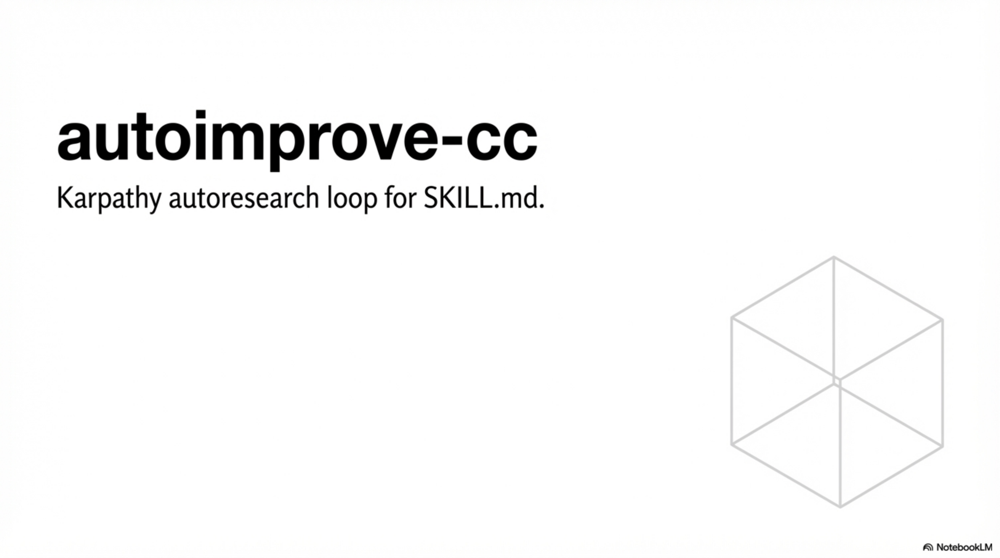
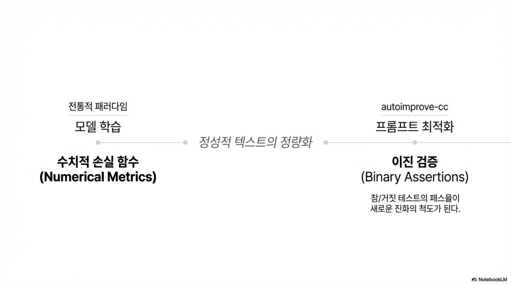
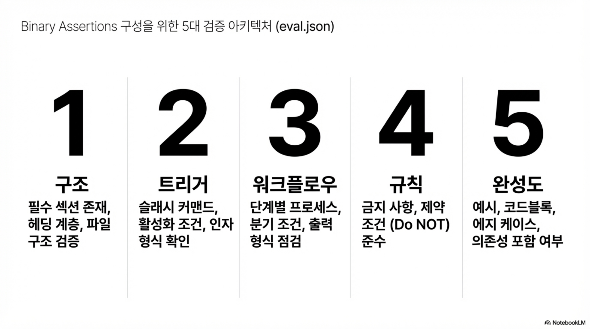
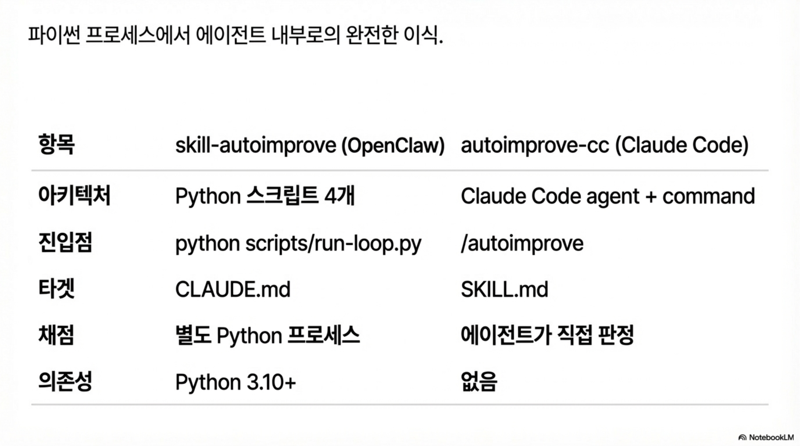

# autoimprove-cc

> Karpathy autoresearch loop for SKILL.md — Claude Code native implementation.

## Skill Evolution (PDF)









(원본 PDF: [assets/skill-evolution.pdf](assets/skill-evolution.pdf))

SKILL.md를 밤새 자동 개선하는 Claude Code 네이티브 시스템.
`/autoimprove` 한 줄로 실행하면, 아침에 더 나은 스킬로 깨어납니다.

Python 스크립트 없이 **Claude Code agents + commands**만으로 동작합니다.

## How It Works

[Karpathy의 autoresearch](https://github.com/karpathy/autoresearch) 루프를 SKILL.md에 적용합니다:

```
1. SKILL.md 읽기
2. eval.json의 binary assertions로 채점
3. 실패한 assertion 하나를 고치도록 SKILL.md 수정
4. 재채점 → 점수 올랐으면 git commit, 아니면 git reset
5. 100% 달성하거나 max_loops까지 반복
```

핵심 차이: Karpathy는 `train.py`의 수치 메트릭을 사용하지만,
우리는 **binary assertions**(참/거짓 테스트)의 패스율을 메트릭으로 사용합니다.

## Quick Start

### 글로벌 설치 (모든 Claude Code 프로젝트에서 사용)

```bash
# 이 저장소를 클론
git clone https://github.com/VoidLight00/autoimprove-cc.git

# Claude Code 글로벌 agents/commands에 심볼릭 링크
ln -s $(pwd)/autoimprove-cc/.claude/agents/skill-optimizer.md ~/.claude/agents/skill-optimizer.md
ln -s $(pwd)/autoimprove-cc/.claude/commands/autoimprove.md ~/.claude/commands/autoimprove.md
```

### 프로젝트별 설치

```bash
# 프로젝트 디렉토리에서
cp -r autoimprove-cc/.claude/agents/skill-optimizer.md .claude/agents/
cp -r autoimprove-cc/.claude/commands/autoimprove.md .claude/commands/
```

### 실행

```bash
# Claude Code 세션에서:

# 1. eval.json 자동 생성 + 루프 실행
/autoimprove skills/my-skill

# 2. eval.json만 생성 (검토 후 수동 실행)
/autoimprove skills/my-skill --gen-eval-only

# 3. 최대 50회 반복
/autoimprove skills/my-skill --max-loops 50

# 4. Dry-run (git 변경 없이 채점만)
/autoimprove skills/my-skill --dry-run
```

## eval.json 작성법

eval.json은 SKILL.md의 품질을 측정하는 **binary assertions** 모음입니다.

### 구조

```json
{
  "skill_name": "my-skill",
  "skill_md_path": "skills/my-skill/SKILL.md",
  "tests": [
    {
      "id": "test-001",
      "description": "구조 — 필수 섹션 존재 여부",
      "prompt": "/my-skill 이라고 입력했을 때",
      "expected_behavior": "스킬이 활성화되고 워크플로우를 시작한다",
      "assertions": [
        "SKILL.md에 스킬 이름이 포함된 H1 헤딩이 있다",
        "Workflow 섹션이 존재한다",
        "Rules 섹션에 최소 2개의 금지 사항이 있다"
      ]
    }
  ]
}
```

### 필드 설명

| 필드 | 설명 |
|------|------|
| `id` | `test-001` 형식의 고유 ID |
| `description` | 테스트 그룹 설명 |
| `prompt` | 사용자가 입력할 프롬프트 시나리오 |
| `expected_behavior` | 프롬프트에 대한 기대 동작 |
| `assertions` | 참/거짓으로 판별 가능한 assertion 배열 |

### 좋은 assertion 작성 팁

```
# 좋은 assertion (명확한 참/거짓)
"SKILL.md에 '## Workflow' 섹션이 존재한다"
"워크플로우에 최소 5개의 단계가 있다"
"코드 블록이 최소 2개 포함되어 있다"

# 나쁜 assertion (주관적, 판단 불가)
"SKILL.md가 잘 작성되어 있다"
"워크플로우가 충분히 상세하다"
```

### 권장 카테고리 (5개)

1. **구조** — 필수 섹션 존재, 헤딩 계층, 파일 구조
2. **트리거** — 슬래시 커맨드, 활성화 조건, 인자 형식
3. **워크플로우** — 단계별 프로세스, 분기 조건, 출력 형식
4. **규칙** — 금지 사항, 제약 조건, Do NOT 항목
5. **완성도** — 예시, 코드블록, 에지 케이스, 의존성

eval.json이 없으면 `/autoimprove`가 SKILL.md를 분석하여 자동 생성합니다.
생성 후 검토하고 필요시 수정하세요.

## Architecture

```
autoimprove-cc/
├── README.md                     ← 이 파일
├── CLAUDE.md                     ← Claude Code 프로젝트 지시문
├── .claude/
│   ├── agents/
│   │   └── skill-optimizer.md    ← 루프 에이전트 (핵심)
│   └── commands/
│       └── autoimprove.md        ← /autoimprove 슬래시 커맨드
├── eval/
│   ├── schema.json               ← eval.json JSON Schema
│   └── examples/
│       ├── example-skill-eval.json
│       └── comet-agent-eval.json
├── skills/
│   └── example-skill/            ← 테스트용 예시 스킬
│       ├── SKILL.md
│       └── eval/
│           └── eval.json
└── LICENSE
```

### 타겟 스킬 디렉토리 구조 (루프 실행 후)

```
skills/my-skill/
├── SKILL.md              ← 개선 대상
└── eval/
    ├── eval.json          ← assertions 정의
    └── improve-log.md     ← 개선 이력 로그
```

## OpenClaw 버전과의 차이

| | skill-autoimprove (OpenClaw) | **autoimprove-cc** (Claude Code) |
|---|---|---|
| 아키텍처 | Python 스크립트 4개 | **Claude Code agent + command** |
| 진입점 | `python scripts/run-loop.py` | **`/autoimprove` 슬래시 커맨드** |
| 타겟 | CLAUDE.md | **SKILL.md** |
| LLM 호출 | `claude -p` subprocess | **Claude Code 에이전트 내장** |
| 채점 | 별도 Python 프로세스 | **에이전트가 직접 판정** |
| 의존성 | Python 3.10+ | **없음 (Claude Code만 필요)** |
| eval 저장 | `<target>/.autoimprove/eval.json` | **`<skill>/eval/eval.json`** |
| 이력 로그 | `history.jsonl` (JSON Lines) | **`improve-log.md` (Markdown)** |
| 설정 파일 | `autoimprove.config.json` | **에이전트 MD에 내장** |

## Karpathy autoresearch란?

[Andrej Karpathy의 autoresearch](https://github.com/karpathy/autoresearch)는
AI 모델이 스스로 코드를 수정하고, 벤치마크를 실행하고, 개선되면 커밋하는 자율 연구 루프입니다.

```
Original (Karpathy):     Our adaptation:
━━━━━━━━━━━━━━━━━━━━     ━━━━━━━━━━━━━━━━━━━━
train.py          →      SKILL.md
numeric metrics   →      binary assertions (pass rate)
git commit/reset  →      git commit/reset (동일)
"never stop"      →      "never stop" (동일)
```

핵심 인사이트: 스킬 품질도 수치화할 수 있다면 자동 최적화가 가능합니다.
Binary assertions는 그 수치화 방법입니다.

## Requirements

- Claude Code CLI (`claude` 명령어)
- 타겟 스킬이 git 저장소 내부일 것 (롤백 기능에 필요)

Python, Node.js 등 외부 런타임 불필요.

## License

MIT

---

*Maintained by Hyeon &middot; Powered by Kraken*
